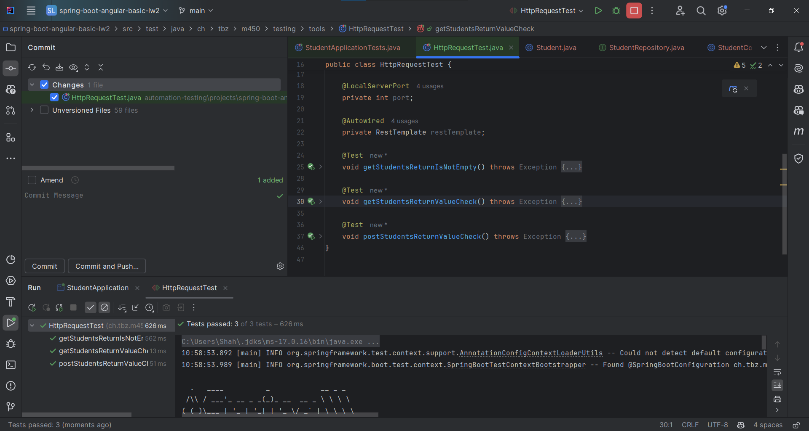
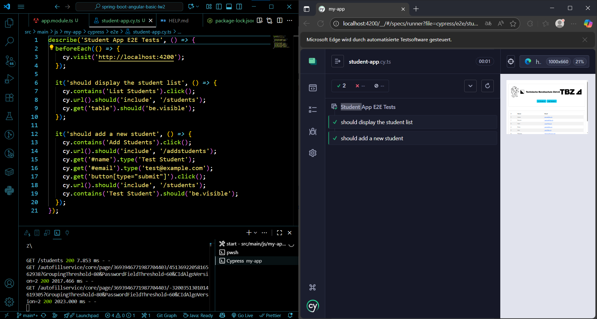

- First i had to setup and start the project
	- i ran the angular application with `ng serve`
	- for the java backend i had to change to the JDK17 to run it
## Task 1
Automate Test the REST Interface of the Backend.
	- Test the GET and PUT (sourcers -> [spring-boot-for-automation-testing-a-testers-guide]([Spring Boot for Automation Testing: A Tester’s Guide - Codoid](https://codoid.com/automation-testing/spring-boot-for-automation-testing-a-testers-guide/)) and [Testing the Web Layer]([Getting Started | Testing the Web Layer](https://spring.io/guides/gs/testing-web)))
	
## Task 2
End-To-End tests Angular with Cypress (source -> [Cypress E2E Testing ]([End-to-End Testing: Your First Test with Cypress | Cypress Documentation](https://docs.cypress.io/app/end-to-end-testing/writing-your-first-end-to-end-test)))

## Task 3
Overload Backend with lots of Traffic (aka Load Testing)

