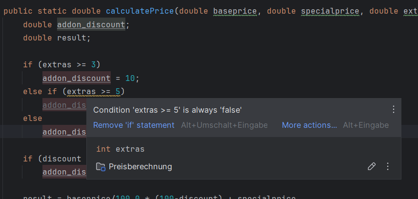

# Aufgaben

Arbeiten Sie zu zweit an diesen Aufgaben.
Stellen Sie sicher, dass Ihre Lösungen in Ihrem Repository abgelegt sind.
Zeigen Sie Ihre Lösungen anschliessend der Lehrperson.

## Aufgabe 1

Welche Formen von Tests kennen Sie aus der Informatik?
Arbeiten Sie zu zweit und erläutern Sie mind. drei Beispiele, die Sie aus der Praxis kennen.
Wie werden die Tests durchgeführt?
- Unit-Test, sobald man eine Funktion/Methode implementiert hat, schreibt man unit-tests, die die Funktionalität von der Funktion/Methode überprüfen.
- Intergration tests, da testet man wie verschieden Teile/Komponent miteinander interagiere, z.B. testet man ob man eine verbindung mit der db erstellen kann.
- End-To-End tests, da testet man wie der user die applikation bedienen wird, z.b im frontend für man solce tests am meisten. also du mocks den user behavior.

## Aufgabe 2

Nennen Sie ein Beispiel eines SW-Fehlers und eines SW-Mangels.
- SW-Fehler: bei telefonnummer input, kann man ein text eingeben anstatt ein nummer
- SW-Mangel: bei telefonnummer input, kann man den Land nicht auswählen

Nennen Sie ein Beispiel für einen hohen Schaden bei einem SW-Fehler.
- beim löschen von ein eintrag, werden alle einträge gelöscht. 
- speicher funktion funktioniert nicht, aber user weiss es nicht.
## Aufgabe 3

Eine Software gliedert sich in der Regel in eine Reihe von Teilsystemen, die wiederum aus einer Vielzahl elementarer
Komponenten besteht. Wir haben im V-Modell gesehen, dass es verschiedene Teststufen gibt. Wir wollen in diesem
Zusammenhang nun ein Beispiel der untersten Stufe anschauen.

**Beispiel Test in der Klasse Preisberechnung**

In der Auto-Verkauf Software werden Preise mit Rabatten versehen.
Wir haben folgende Elemente und Regeln:
Es besteht ein Grundpreis (*baseprice*), abzüglich Händlerrabatt (*discount*).
Dazu kommen Sondermodellaufschlag (*specialprice*) und der Preis für weitere Zusatzaustattungen (*extraprice*).
Wenn drei oder mehr Zusatzausstattungen (*extras*) ausgewählt werden, dann erfolgt ein Rabatt von 10% auf diesen
Ausstattungen. Wenn es fünf oder mehr Zusatzausstattungen sind, dann ist der Rabatt bei 15%.
Der Händlerrabatt bezieht sich auf den Grundpreis. Der Zubehörrabatt gilt nur für den Preis der Zubehörteile.
Ein Code würde somit so aussehen:

`

        double calculatePrice(double baseprice, double specialprice, double extraprice, int extras, double discount) {
            double addon_discount;
            double result;
            
            if (extras >= 3) 
                addon_discount = 10;
            else if (extras >= 5)
                addon_discount = 15;
            else 
                addon_discount = 0;
            
            if (discount > addon_discount)
                addon_discount = discount;
            
            result = baseprice/100.0 * (100-discount) + specialprice
                    + extraprice/100.0 * (100-addon_discount);
            
            return result;
	    }

`

Setzen Sie diesen Code in Ihrer Entwicklerumgebung um. Erstellen Sie nun einen entsprechenden *Testtreiber*, um diese
Preisberechnung zu testen. Ein Testtreiber ist ein Programm, das die jeweiligen Schnittstellenaufrufe (Methoden-Aufruf)
ausführt und anschliessend das Resultat zurückerhält. Skizzenhaft würde das so aussehen:

`
    
    boolean test_calculate_price(){

        double price;
        boolean test_ok = true;
    
        < your code>

    }
`
Stellen Sie Ihre Tests ins Repository und zeigen Sie Ihre Lösung der Lehrperson.

## Aufgabe 3 - Bonus

Das Programmstück ist fehlerhaft ;) Finden Sie den Fehler im Code. Was müsste man korrigieren?
- anstatt zuerst zu kontrollieren ob `extras >= 3` sollte man zuerst `extras >= 5` kontrollieren. z.B. bei 10 extras kontrolliert 
er zuerst ob es grösser/gleich 3 ist, was wahr ist, und somit wird der addon_discount auf 10 gesetzt, obwohl es 15% sein sollte. das hat der IDE von sich selbst bemerkt. 

