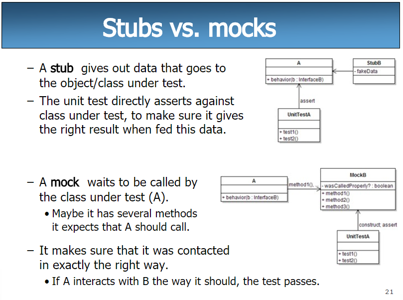

# Schnittstellen
### Test Doubles
- Test Doubles are divided in two main categories: 
    - Mock (mock, spy)
    - Stub (stub, dummy, fake)
- Mocks vs Stubs = Behavioral Testing vs State Testing
- The purpose of both is to eleminate dependencies in unit tests

- Stubs: are like a "fake" implementation of a class, which returns 
hardcoded data <br>
here an example of a stub:
```csharp
public class UserService
{
    private readonly User _user;
    public virtual User GetUser(int id)
    {
        return _user.where(u => u.Id == id);
    }
}

public class UserServiceStub : UserService
{
    public override User GetUser(int id)
    {
        return new User { Id = id, Name = "Gugus User" };
    }
}
```
- Mocks: are like a "fake" implementation of a class, but they also
track how they were called (e.g. which methods were called, with which
arguments) <br>
- by Behavioral Testing we mean that we want to test the behavior of a class, in 
simple terms: we want to test if a method was called, how many times it was called,
with which arguments it was called, etc.
- by State Testing we mean that we want to test the state of a class, in simple
terms: we want to test if the state of an object is as expected after a method call.

### Lifecycle
- Stubs:
  1. Setup: prepare object that is being tested and the stub
  2. Exercise: call the method being tested/test functionality
  3. Verify: check the state of the object being tested, to se if it is as expected
  4. Teardown: clean up any resources used during the test, by disposing objects so
that they are not interfering with other tests
- Mocks:
    1. Setup: prepare object that is being tested and the mock
    2. Setup Expectations: define how the mock should behave when its methods are 
    called
    3. Exercise: call the method being tested/test functionality
    4. Verify Expectations: check if the expectations set on the mock were met, like
    if the methods were called, how many times they were called, with which arguments
    5. Verify State: check the state of the object being tested, to se if it is 
    as expected, like if it has the expected values.
    6. Teardown: clean up any resources used during the test, by disposing objects.
### Mock, Spy, Dummy, Stub and Fake
- Mock: are object that can be told what they expect to receive. Here's how it goes:
    1. You set up the mock with expectations (e.g., "I expect this method to be 
    called with these parameters").
    2. You run your test, which interacts with the mock. (SUT -> System Under Test calls the mock)
    3. After the test, you verify that the expectations were met (e.g., "Was the method called as expected?").
- Spies: they are similar to mocks, but they mainly focus on logging interactions. 
unlike mocks they don't fail the the test if the expectations are not met, they just
continue and log the interactions for later verification.
- Dummies: are never used in tests, they are just used to fill parameter lists.
For example, if a method requires an object as a parameter but the object is not
used in the test, you can pass a dummy object.
- Stub: provide predetermined responses to method calls made during testing, 
allowing developers to isolate the behavior of the component being tested from its 
dependencies.
- Fakes: are a bit more complex test doubles that have a working implementation, what
do i mean by that? let's take for example, an in-memory database, it behaves like
a real database, but it's not, it's just for testing purposes. In General they're
used when something is too complex to be easily mocked/stubbed but a full 
implementation is not needed.