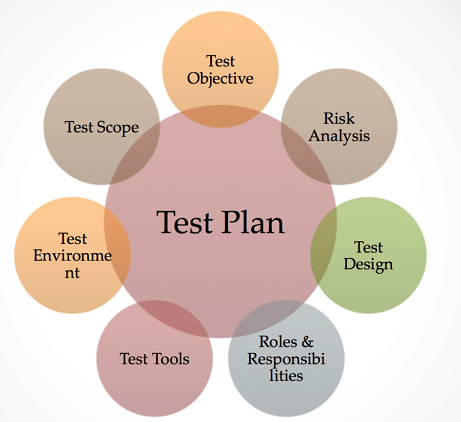

# Teststrategie und Testkonzept
**Strategy** defines explains how to proceed during testing (**Approach**). This is defined in a **Test-Concept**, wich basically builds a **Masterplan** for testing, that's why it's also called *Testplan*, and it consists of the following:

## Testkonzept nach IEEE 829
You can think **IEE 829** as a *Checklist* for the Test-Concept elements, but you don't have to necessarily use all of the elements.
### Test-Items
All elements to be tested are listed and described here, so you're basically creating a *Big Picture* of the application. You create a ***Drawing of the Architecture*** (a Diagramm that displays all components), where you define what to test and what not.
### Feature to be tested
Now the test items can be broken down into ***individual*** features (functionalities). Here is a detailed list of the functionalities that we are testing.
### Features not to be tested
As the name says, here you define what not to test, like non-functional aspects of a software.
### Approach
Here you describe your test-method, for example "*In the development team (Dev Team), unit tests are executed through unit tests. The test procedure is implemented by TDD (Test Driven Development).*"
### Item Pass/ Fail Criteria
Here you define the criterias for a successful/failed test and also classify them. like this.
- Minor bugs (the application runs but has certain flaws)
- Moderate errors (the application has obvious errors)
- Fatal errors (the application crashes)
### Test Deliverables
Here you define the *Test Artifacts*, wich are basically tools/documents provided for the tests. The ***Test-Concept*** itself is a *Test Articaft*, even *Postman* counts too.
### Testing-Tasks
Here you define the Test-Levels, like are only doing *unit-tests* or maybe even *integration-tests*?
### Environmental Needs
Here the Testing-Environment (Hardware/Software) is defined, wich you need for testing.
### Schedule
Here you define when to run tests, so for example, if you apply the **TDD** you write unit-tests first. The integration tests are only carried out when all components have reached a certain stage of development.
### Extra Elements
there are also some organizational aspects in the project, like responsibilities, personell (staffing & training) and the acceptance criteria.