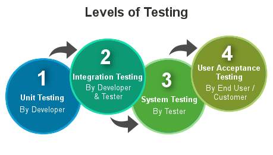

# Test-Levels
| Shortcuts | Definition |
|---|---|
| UAT | User Acceptance Testing |
| QA | Quality Assurance |
| E2E | End-to-End |
| SLA | Service Level Agreement |
- there are different types of test levels, here are some:
    - Unit-Testing / Component Testing (z.B. testing a single function or 
    class)
    - Integration Testing (z.B. testing interactions between multiple 
    components or a new feature)
    - System Testing  (z.B. end-to-end testing of the entire application)
    - Acceptance Testing (z.B testing if the application meets business
    requirements)
    
- Going over some terms again:
    - White-Box Testing:
        - testing with knowledge of the internal workings of the system
        - focuses on code structure, logic, and paths
        - often used in unit testing and integration testing    
    - Black-Box Testing:
        - testing without knowledge of the internal workings of the system
        - focuses on inputs and expected outputs (functional requirements)
        - often used in system testing and acceptance testing
## Details about Test-Levels
### Unit-Testing
- white-box
- written and run by the devs (later automated during build/deployment, 
unless running script language)
- testing isolated components (e.g. functions)
- function requirements are tested
- but cannot test interactions between components
### Component-Testing
- white-box
- written and run by the devs
- interactions between multiple components are tested (e.g. classes)
- interfaces are mocked here (z.B. database, apis, message queues)
### Integration-Testing
- black-box
- run by devs or testers (QA Team -> Quality Assurance)
- no mock is used here, real services are used, since integration is tested
- z.B. testing an API endpoint that interacts with a database, the testers
don't know how the endpoint is implemented, they just test if the endpoint
works as expected.
> [!NOTE]  
> since sometimes the devs are testing, then it is white-box testing, but if
> the testers are testing, then it is black-box testing.
### System-Testing
- black-box
- tested by the same team as integration testing
- whole software is tested (end-to-end)
- an environment that closely resembles production is used
- functional and non-functional (z.B. bottlenecks, performance, usabilty, security) requirements are tested
### Acceptance-Testing
- black-box
- run by bussiness/customers
- tests if the software meets business/acceptance requirements

## Unit-Testing
- unit-testing is the most basic level of testing, you are testing a single
'unit' of code, usually a function or a method, to ensure it works as
expected. Unit tests are usually written by the developers who wrote the
code being tested. To ensure quality they are run very frequently. They are
usually automated and run as part of the build process.
- **Pros of Unit-Testing:**
    - essential step while refactoring
    - fast error detection
    - documentation of the code (what the code is supposed to do)
### what distinguishes a good unit-test?
    - Isolation, each test should be independent of others and the order of
    execution should not matter.
    - Full Automation, tests should be automated and run as part of the
    build process.
    - Quick Execution, tests should run quickly to provide fast feedback.
    - Easy to Understand and short, tests should be easy to read and 
    understand.
    - Ideally written before the code (TDD - Test Driven Development)
    - Repeatable, tests should produce the same results every time they are
    run.
### Principles of Unit-Testing
- **F.I.R.S.T**:
    - Fast
    - Independent
    - Repeatable (not depending on data or environment/same result every 
    time/each test arranges its own data)
    > [!NOTE]  
    > What if a set of tests need some common data? Use Data Helper classes
    > that can setup this data for re-usabilty.
    - Self-Validating (no manual inspection of results (pass/fail))
    - Timely/Thorough (cover every use case, not aiming for 100% coverage, but
    cover as much as possible) 