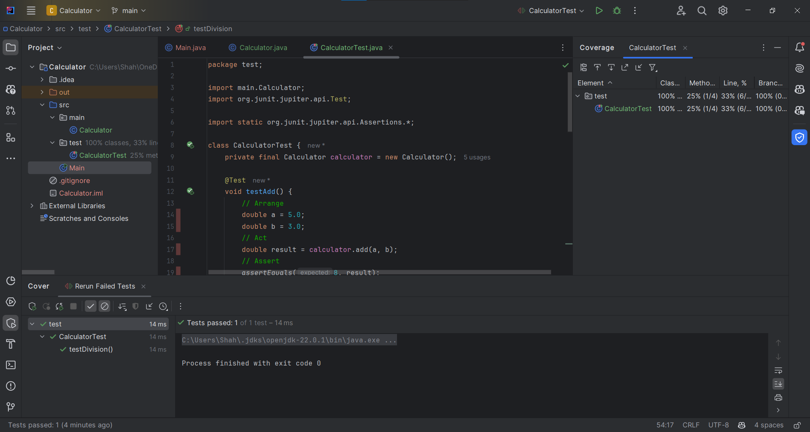
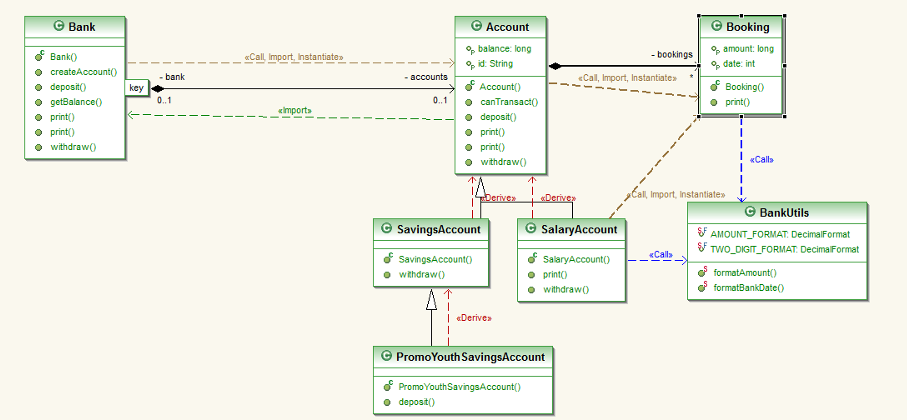

# Tasks
### Task 1: Simple Calculator
* Machen Sie sich mit JUnit Tests vertraut, indem Sie für eine *Calculator* Klasse entsprechende Unit-Tests schreiben.
* Ihre *Calculator* Klasse hat z.Bsp. folgende Methode:

```java
public double add(double summand1, double summand2) {
  return summand1 + summand2;
}
```

* Erstellen Sie die Klasse mit allen Methoden in einem main package
* Nun erstellen Sie in einem test package die entsprechende Unit Test Klasse. Verwenden Sie die korrekten Annotations aus JUnit 5.
* Testen Sie die verschiedene Fälle und alle Methoden +,-,*,/ und führen Sie dann die Tests durch:
    1)	Mit Entwicklungsumgebung ausführen
    
    2)	Mit Maven auf der Kommandozeile ausführen (did not work since i don't have maven isntalled)
    but it's like this -> `mvn test -Dtest=testClassName#testFunctionName`
---
### Task 2: JUnit Summary
- JUnit 5 = JUnit Platform + JUnit Jupiter + JUnit Vintage
    - Junit Platform: Foundation/Core/Base to launch testing frameworks, so if you
    want to create your own testing framework you can use the platform to launch it,
    on the JVM (Java Virtual Machine).
    It also defines/specifies the TestEngine API for developing a testing framework
    that runs on the platform, by doing this you can plug 3rd party testing
    libraries into JUnit.
    - Junit Jupiter: Includes new programming and extension model for writing tests
    for example @Disabled wich disables a test class/method.
    - Junit Vintage: provides Backward Compatibility to Junit 3 and 4, so that if
    you have old tests you can still run them with Junit 5 and you don't have to 
    rewrite them. pretty useful.
    - Among the features theres:
        - Assertions: assertEqual, assertTrue, asserThrows
        - Assumption: runs tests only if certain conditions are met, here an example
        ```java
        @Test
        void trueAssumption() {
            assumeTrue(5 > 1);
            assertEquals(5 + 2, 7);
        }

        @Test
        void falseAssumption() {
            assumeFalse(5 < 1);
            assertEquals(5 + 2, 7);
        }
        @Test
        void assumptionThat() {
            String someString = "Just a string";
            assumingThat(
                someString.equals("Just a string"),
                () -> assertEquals(2 + 2, 4)
            );
        }
        ```
- Sources:
    - [Guide to JUni5](https://www.baeldung.com/junit-5)
    - [Advanced Guide to JUnit5](https://testgrid.io/blog/junit-testing/)
    - [JUnit5 User Guide](https://docs.junit.org/current/user-guide/#overview-what-is-junit-5) 
### Task 3: Bank Simulation

- Document the Software and the connections between the classes with UML diagrams.
    - Each Bank has multiple Accounts
    - When you create a new Account you have to choose between SavingsAccount,
    SalaryAccount and PromoYouthSavingsAccount, since they all extend the Account
    class. But the PromoYouthSavingsAccount extends the SavingsAccount.
    - Each Account has Bookings, wich contains the details about the transaction date
    and the amount of money that was transferred.
    - Bookings have a date and amount format, so like amount always has 2 decimal 
    places.
    - You can deposit and withdraw money from an Account. 
### Task 4: Implement Unit Tests